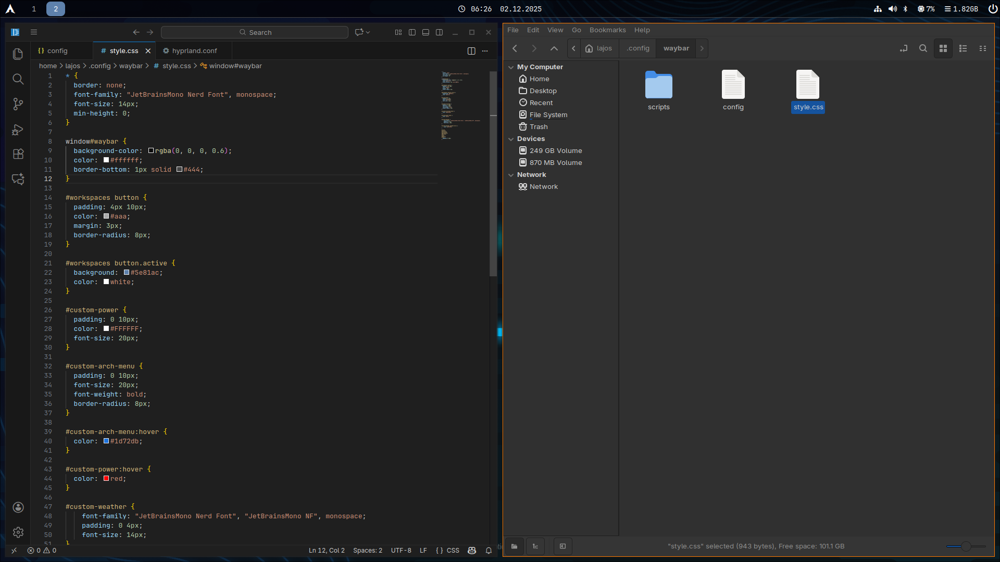

Hyprland Dotfiles

These are my personal dotfiles and Hyprland configs. They include everything required after a minimal Arch Linux install, but they can be used on other distros as well.

The setup is clean, minimal and focuses on a simple workflow.

Description:

- Minimal design
- [Hyprland](https://hypr.land/) + Wayland focused
- Easy to reuse on a new system
- Lightweight and fast
- No unnecessary dependencies
- Many config uses jetbrains mono font: ttf-jetbrains-mono-nerd
- Install [nwg-look](https://github.com/nwg-piotr/nwg-look) to set your theme. (no themes included, the default is gtk light or dark)

After downloaded the repo to your ~/dotfiles with: `git clone https://github.com/mrlajos/dotfiles-hyprland.git ~/dotfiles`
use "restore-dotfiles.sh" to copy the files to their locations. When finished restart hyprland.
If you modify config files and wish to push it to github use "collect-dotfiles.sh" to copy all config files to ~/dotfiles.

## Preview

